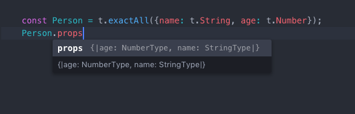
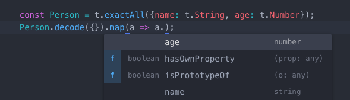

[](https://circleci.com/gh/orlandoc01/io-flow-types/tree/master)

# Summary
The work that gcanti has done with [io-ts](https://github.com/gcanti/io-ts) is really useful, but it relies on a lot of language semantics that are exclusive to Typescript and the work on [flow-io](https://github.com/gcanti/flow-io) is now deprecated and no longer maintained. As a result, I have forked his work and refactored a lot of the existing combinators/classes so they more easily align with the semantics of [Flow](https://flow.org/). 

# The idea

Blog post: ["Typescript and validations at runtime boundaries"](https://lorefnon.tech/2018/03/25/typescript-and-validations-at-runtime-boundaries/) by [@lorefnon](https://github.com/lorefnon)

Similiar to [io-ts](https://github.com/gcanti/io-ts), a value of type `Type<A, O, I>` (called "runtime type") is the runtime representation of the static type `A`.

A runtime type can

- decode inputs of type `I` (through `decode`)
- encode outputs of type `O` (through `encode`)
- be used as a custom type guard (through `is`)

```javascript
type Validation<A> = Either<Errors, A>;

class Type<A, +O = A, I = mixed> {
  +_A: A
  +_O: O
  +_I: I
  constructor(
    /** a unique name for this runtime type */
    name: string,
    /** a custom type guard */
    is: (v: mixed) => boolean,
    /** succeeds if a value of type I can be decoded to a value of type A */
    validate: (input: I, context: Context) => Validation<A>,
    /** converts a value of type A to a value of type O */
    encode: (a: A) => O
  ) {}
  /** a version of `validate` with a default context */
  decode(i: I): Either<Errors, A>
}
```

**Example**

A runtime type representing `string` can be defined as

```javascript
import * as t from 'io-flow-types'

// runtime type definition
export class StringType extends t.Type<string> {
  // equivalent to Type<string, string, mixed> as per type parameter defaults
  constructor() {
    super(
      'string',
      (m): m is string => typeof m === 'string',
      (m, c) => (this.is(m) ? t.success(m) : t.failure(m, c)),
      t.identity
    )
  }
}

// runtime type instance: use this when building other runtime types instances
export const string = new StringType()
```

A runtime type can be used to validate an object in memory (for example an API payload)

```javascript
const Person = t.inexactAll({
  name: t.String,
  age: t.Number
})

// validation succeeded
Person.decode(JSON.parse('{"name":"John","age":43}')) // => right({name: "John", age: 43})

// validation failed
Person.decode(JSON.parse('{"name":"John"}')) // => left([...])
```
# Implemented types / combinators

```javascript
import * as t from 'io-flow-types'
```

| Type                      | Flow                              | Runtime type / combinator                             |
| ------------------------- | --------------------------------------- | ----------------------------------------------------- |
| null                      | `null`                                  | `t.Null`                             |
| undefined                 | `undefined`                             | `t.Undefined`                                         |
| void                      | `void`                                  | `t.Void`                              |
| string                    | `string`                                | `t.String`                                            |
| number                    | `number`                                | `t.Number`                                            |
| boolean                   | `boolean`                               | `t.Boolean`                                           |
| any                       | `any`                                   | `t.Any`                                               |
| never                     | `never`                                 | `t.Never`                                             |
| object                    | `object`                                | `t.object`                                            |
| integer                   | ✘                                       | `t.Integer`                                           |
| literal                   | `'s'`                                   | `t.literal<'s'>('s')`                                      |
| array of any              | `Array<mixed>`                          | `t.arrayType`                                             |
| array of type             | `Array<A>`                              | `t.array(A)`                                          |
| readonly array            | `$ReadOnlyArray<A>`                | `t.readonlyArray(A)`                         
| dictionary of any         | `{ [key: string]: mixed }`              | `t.Dictionary`                                        |
| dictionary of type        | `{ [key: A]: B }`                       | `t.dictionary(A, B)`                                  |
| tuple                     | `[ A, B ]`                              | `t.tuple([ A, B ])`                                   |
| union                     | `A | B`                                | `t.union([ A, B ])` or `t.unionMap({tagVal1: A, tagVal2: B}, toTagName | tagName)` |
| intersection              | `A & B`                                 | `t.intersection([ A, B ])`                            |
| keyof                     | `keyof M`                               | `t.keyof(M)`                                          |
| refinement                | `A`, `Opaque: A`                        | `t.refinement(A, predicate)` or `t.opaqueRefine<A, Opaque: A>(A, predicate)`                          |
| exact types               | {\| a: A, b?: B\|}                      | `t.exact({required: {a :A}, optional: {b: B}})`|
|                           | {\| a: A, b: B \|}                       | `t.exactAll({a: A, b: B})` |
|                           | {\| a?: A, b?: B \|}                    | `t.exactShape({a: A, b: B}` |
| inexact types             | { a: A, b: b }                          | `t.inexact({required: {a: A}, optional: {b: B}})` |
|                           | { a: A, b: B }                          | `t.inexactAll({a: A, b: B})` |
|                           | { a?: A, b?: B }                        | `t.inexactShape({a: A, b: B})` |

*Note*: Assume `A` and `B` are instances of the `t.Type` class


# Flow compatibility

The library is tested against a range of `flow-bin` versions, which is listed as the `peerDependencies` section of this NPM package.

# Error reporters

A reporter implements the following interface

```javascript
interface Reporter<A> {
  report: (validation: Validation<any>) => A
}
```

This package exports two default reporters

- `PathReporter: Reporter<Array<string>>`
- `ThrowReporter: Reporter<void>`

Example

```javascript
import { PathReporter } from 'io-flow-types/lib/PathReporter'
import { ThrowReporter } from 'io-flow-types/lib/ThrowReporter'

const result = Person.decode({ name: 'John' })

console.log(PathReporter.report(result))
// => ['Invalid value undefined supplied to : { name: string, age: number }/age: number']

ThrowReporter.report(result)
// => throws 'Invalid value undefined supplied to : { name: string, age: number }/age: number'
```

You can define your own reporter. `Errors` has the following type

```javascript
type ContextEntry = {
  +key: string
  +type: Decoder<any, any>
}
type Context = $ReadonlyArray<ContextEntry> {}
type ValidationError = {
  +value: mixed
  +context: Context
}
type Errors = Array<ValidationError> {}
```

Example

```javascript
import * as t from 'io-flow-types'

const getPaths = <A>(v: t.Validation<A>): Array<string> => {
  return v.fold(errors => errors.map(error => error.context.map(({ key }) => key).join('.')), () => ['no errors'])
}

const Person = t.type({
  name: t.string,
  age: t.number
})

console.log(getPaths(Person.decode({}))) // => [ '.name', '.age' ]
```

# Flow integration

Runtime types can be inspected



This library uses FLow extensively. Its API is defined in a way which automatically infers types for produced values



Static types can be extracted from runtime types using the `TypeOf` operator

```javascript
type IPerson = t.TypeOf<typeof Person>;

// same as
type IPerson = {
  name: string
  age: number
};

// also the same as
type IPerson = $PropertyType<typeof Person, '_A'>;
```

# Union Maps

If you are encoding tagged unions, instead of the general purpose `union` combinator, you may want to use the
`unionMap` combinator in order to get better performances

```javascript
const A = t.exactAll({
  tag: t.literal('A'),
  foo: t.string
})

const B = t.exactAll({
  tag: t.literal('B'),
  bar: t.number
})

const U = t.unionMap({A, B}, 'tag')
```

# Refinements

You can refine a type (_any_ type) using the `refinement` combinator

```javascript
const Adult = t.refinement(Person, person => person.age >= 18, 'Adult')
```

However, unless you utilize Flow's opaque types, this can't be enforced via a static check. For stricter safety, you should use the `opaqueRefine` function and supply the opaque type as a generic

```javascript
opaque type Positive: number = number;
const positive = t.opaqueRefine<typeof t.Number, Positive>(t.Number, num => num > 0, 'Positive')
```


# Mixing required and optional props

You can mix required and optional props using an intersection

```javascript
const required = {foo: t.string};
const optional = { bar: t.number }
const C = t.exact<typeof required, typeof optional>({required, optional})
type CT = t.TypeOf<typeof C>;

// same as
type CT = {
  foo: string
  bar?: number
}
```

You can call `shape` to an already defined runtime type if created with one of the `exact` or `inexact` functions

```javascript
const PersonType = t.exactAll({
  name: t.string,
  age: t.number
})

const PartialPersonType = Person.shape();

type PartialPerson = t.TypeOf<typeof PartialPersonType>;

// same as
type PartialPerson = {
  name?: string
  age?: number
}
```

# Custom types

You can define your own types. Let's see an example

```javascript
import * as t from 'io-flow-types'

// represents a Date from an ISO string
const DateFromString = new t.Type<Date, string>(
  'DateFromString',
  (m): m is Date => m instanceof Date,
  (m, c) =>
    t.string.validate(m, c).chain(s => {
      const d = new Date(s)
      return isNaN(d.getTime()) ? t.failure(s, c) : t.success(d)
    }),
  a => a.toISOString()
)

const s = new Date(1973, 10, 30).toISOString()

DateFromString.decode(s)
// right(new Date('1973-11-29T23:00:00.000Z'))

DateFromString.decode('foo')
// left(errors...)
```

Note that you can **deserialize** while validating.

# Tips and Tricks

## Is there a way to turn the checks off in production code?

No, however you can define your own logic for that (if you _really_ trust the input)

```javascript
import * as t from 'io-flow-types';

const { NODE_ENV } = process.env

export function unsafeDecode<A, O>(value: mixed, type: t.Type<A, O>): t.Either<t.Errors, A> {
  if (NODE_ENV !== 'production' || type.encode !== t.identity) {
    return type.decode(value)
  } else {
    // unsafe cast
    return t.Right((value: any): A)
  }
}

// or...

import { failure } from 'io-flow-types/lib/PathReporter'

export function unsafeGet<A, O>(value: mixed, type: t.Type<A, O>): A {
  if (NODE_ENV !== 'production' || type.encode !== t.identity) {
    return type.decode(value).getOrElseL(errors => {
      throw new Error(failure(errors).join('\n'))
    })
  } else {
    // unsafe cast
    return ((value: any): A)
  }
}
```

## Union of string literals

Use `keyof` instead of `union` when defining a union of string literals

```javascript
const Bad = t.union([
  t.literal<'foo'>('foo'),
  t.literal<'bar'>('bar'),
  t.literal<'baz'>('baz')
  // etc...
])

const Good = t.keyof({
  foo: null,
  bar: null,
  baz: null
  // etc...
})
```

Benefits

- unique check for free
- better performance
- quick info stays responsive

# Known issues

- TODO
